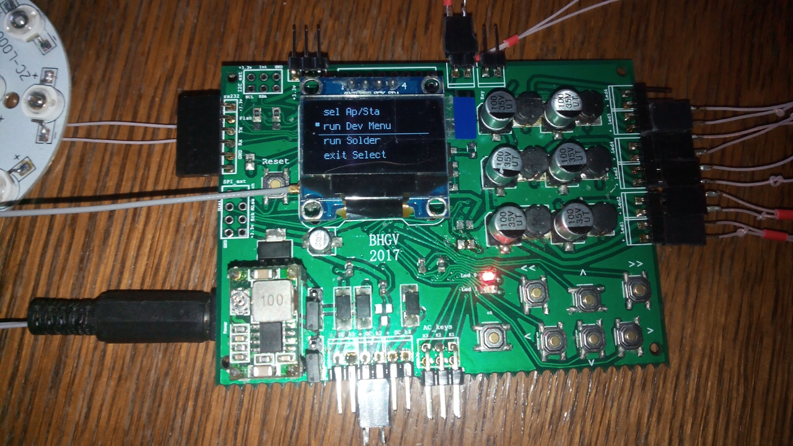

luOS9p
------

It is an OS for ESP8266 IoT microcontrollers based on Lua-RTOS-ESP8266. But it was significally checked, changed and expanded.

Features
========
* Lua 5.3.4,
* Multithreading using Free-RTOS,
* UART (ttl rs232, com port),
* I2C,
* SPI,
* 16 PWMs (hardware),
* 16 PIOs,
* 5 ADC (3 up to 3v + 1 up to 1v + 1 used internally),
* 1 DAC (up to 3v),
* OLED screen,
* Keyboard with 8 buttons (cursor + 3 special + 1 external),
* GUI (menu based. using OLED and keyboard),
* Shell by remote (rs232) terminal,
* internal Editor of files (remote terminal),
* big set of easy to use shell commands (filesystem, ports, devices, network, server, other)
* net Ap and Sta modes,
* one command WiFi Sta search,
* PID regulator module,

* Webserver (with compressing):
  1. static HTML,
  1. CGI,
  1. WebSock (up to 5 connections),
  1. direct access to devices/ports using WebSock,

* 9p2000/Styx (Plan9/Inferno os) distributed network virtual file system + server:
  1. list of devices (ex: `ls /n/dev`),
  1. list of device's functions (ex: `cat /n/dev/pwm`),
  1. call a device's function (ex: `echo ch_val -i 5 -n 0.4 > /n/dev/pwm`),
  1. read the result of the function's call (ex: `cat /n/dev/pwm` immediatly after the call),
  1. read a file/folder list from the fisical filesystem of the device (ex: `ls /n/fs/html/js`),
  1. read/write/create files on the device's fisical filesystem (ex: `cat /n/fs/html/js/common.js` or `echo a Text > /n/fs/afile.txt`),
  1. create new folders on the device's fisical filesystem (ex: `mkdir /n/fs/new_folder`),
  1. remove files or folders from the fisical device's filesystem (ex: `rm /n/fs/html/a_file_or_folder`).

* PC-Studio for easyer upload/download/edit files into/from/on the luOS9p embedded filesystem. also PC-Studio contains remote terminal for luOS9p and other features (in the future). It is written on the Lua and may be edited/expanded easily. It also contains a plugin system for extensions, but it isn't activated for now.


How to build
============
```
./bld.sh    # build
./flash.sh  # flash
```

How to build PC-Studio
======================
```
cd pc-studio
./bld.sh
```

How to run PC-Studio
====================
```
cd pc-studio/bld
./prg
```

How to run Styx server
======================
In the device's console or from the lua script:
```
thread.start( styx.loop )
```
Or just select `Styx server` on the device's gui if you are using LuOS9p-PCB (or other with ported GUI driver)

In the inferno shell/script/limbo etc:
```
mount -A tcp!<IP address of your device>!6701 /n
```
Now your IoT device's styx virtual fs is mounted to `/n` folder, including branches for drivers `/dev` and for access to the fisical filesystem of the your IoT device `/fs`. Use it as a regular filesystem.


A special board for the luOS9p
==============================
For this OS was designed a special PCB that included all the necessary hardware/drivers and supports all the features of the OS.

But the OS may be used with the most esp8266-based boards (maybe with changes in the drivers part of the OS according to the target hardware)
